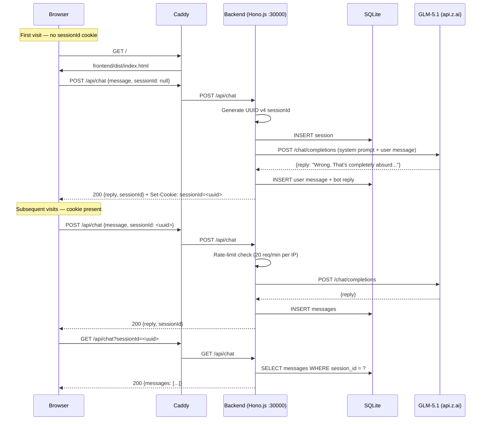

# Absolutely Wrong — Architecture

> Last updated: 2026-05-21
> For: developers and AI agents working on this codebase. Read `docs/about.md` for the product vision; `docs/specs.md` for detailed requirements.

## High-Level Overview

Absolutely Wrong is a **single-page parody chat application** where an AI bot (GLM-5.1) always confidently disagrees with the user in an arrogant, mentor-like tone. The entire stack is deliberately minimal — no auth, no user accounts, no complex infrastructure. A visitor opens the page, sends a message, and gets a disagreeable response. That's it.

**Core paradigm:** stateless frontend + stateful backend session. The frontend is a static SPA served by Caddy. All state lives in an SQLite file on the server, keyed by an httpOnly `sessionId` cookie. The backend proxies chat requests to GLM-5.1 (api.z.ai), stores message history, enforces rate limits, and cleans up stale sessions.

**Design principles:**
- **Minimal moving parts** — no Redis, no message queue, no Docker. One process, one DB file, one VPS.
- **Build in CI, serve on VPS** — no runtime compilation on the server. CI produces `dist/` for both frontend and backend.
- **Fully anonymous** — no PII collection. HTTP cookie is the only identifier, invisible to JavaScript.
- **Graceful degradation** — if GLM is down, show a fallback message. If DB is down, work in-memory.

## Diagram

### Deployment Topology (ASCII)

```
                          VPS (techmeat.dev)
 ┌──────────────────────────────────────────────────────┐
 │                                                      │
 │  ┌──────────┐     HTTPS      ┌───────────────┐      │
 │  │  Browser │───────────────▶│    Caddy      │      │
 │  │          │◀───────────────│  (reverse      │      │
 │  └──────────┘                │   proxy)       │      │
 │                              └───┬───────┬───┘      │
 │                                  │       │           │
 │                    /* (static)   │       │  /api/*  │
 │                                  │       │   (proxy) │
 │                          ┌───────▼──┐ ┌──▼────────┐ │
 │                          │ frontend/ │ │ backend/   │ │
 │                          │ (Vite     │ │ (Hono.js   │ │
 │                          │  dist/)   │ │  :30000)   │ │
 │                          └──────────┘ └──┬─────────┘ │
 │                                          │           │
 │                              ┌───────────▼─────────┐ │
 │                              │   SQLite            │ │
 │                              │   (backend/absolutely│ │
 │                              │    _wrong.db)       │ │
 │                              └─────────────────────┘ │
 │                                                      │
 └──────────────────────────────────────────────────────┘
                                    │
                                    │ HTTPS
                                    ▼
                          ┌─────────────────┐
                          │   api.z.ai      │
                          │   (GLM-5.1)     │
                          └─────────────────┘
```

### Data Flow (Mermaid)



## Components

### Frontend — React SPA (`frontend/`)

| Aspect | Detail |
|---|---|
| **Framework** | React 19.2.6 |
| **Build tool** | Vite 8.0.14 |
| **Runtime** | Static files (no SSR, no Node.js on the serving path) |
| **Deploy artifact** | `frontend/dist/` — HTML + JS + CSS + assets |
| **Served by** | Caddy, route `/*` (after `/api/*` is matched first) |
| **Key libraries** | `react-dom` 19.2.6, `@vitejs/plugin-react` 6.0.2 |
| **Design** | Mobile-first, single chat view, no routing |

**Responsibilities:**
- Render chat UI: message list, input field, send button
- Send messages via `POST /api/chat`
- Load history via `GET /api/chat?sessionId=...`
- Clear history via `DELETE /api/chat?sessionId=...`
- Show "typing..." indicator while waiting for response
- Display bot avatar next to bot messages
- Handle rate-limit (429) and error (500) responses gracefully

**Architectural invariant:** The frontend never reads the `sessionId` cookie (it's httpOnly). Session identity travels in JSON bodies and query params, never in JavaScript-accessible storage.

### Backend — Hono.js Server (`backend/`)

| Aspect | Detail |
|---|---|
| **Framework** | Hono.js 4.12.21 |
| **Runtime** | Node.js ≥22 LTS (v24.15.0 on the VPS) |
| **Server adapter** | `@hono/node-server` 2.0.3 |
| **Language** | TypeScript 6.0.3, compiled to JS via `tsc` |
| **Port** | 30000 (internal, Caddy proxies `/api/*` to it) |
| **Deploy artifact** | `backend/dist/` — compiled JavaScript from CI |
| **Start command** | `node dist/index.js` |

**Responsibilities:**
- **POST /api/chat** — receive message, call GLM-5.1, store in DB, return reply
- **GET /api/chat** — return message history for a session
- **DELETE /api/chat** — delete all messages for a session
- **GET /api/health** — health-check endpoint (`{"status": "ok"}`)
- **Session management** — create UUID v4 session on first visit, issue httpOnly cookie
- **Rate limiting** — in-memory counter, 20 req/min per IP (Hono middleware)
- **Input validation** — message length 1–2000 chars, sessionId UUID v4 format
- **Error handling** — GLM timeout (15s) → fallback message; DB errors → 500
- **Session cleanup** — cron-style `setInterval` deletes sessions older than 7 days

**Architectural invariants:**
- The backend never trusts raw user input — all messages are validated and sanitized before DB insertion.
- GLM API key is read from `process.env.GLM_API_KEY` at startup, never logged or exposed.
- CORS is restricted to `https://absolutely-wrong.techmeat.dev` only.

### SQLite Database

| Aspect | Detail |
|---|---|
| **Library** | `better-sqlite3` 12.10.0 (synchronous, native bindings) |
| **File location** | `backend/absolutely_wrong.db` |
| **Persistence** | Not overwritten on deploy. Migrations run at server startup. |
| **Backup** | Not critical — data is purely entertainment. No backup strategy in MVP. |

**Schema:**

```sql
-- Sessions table
CREATE TABLE sessions (
  id TEXT PRIMARY KEY,                                -- UUID v4
  created_at TEXT NOT NULL DEFAULT (datetime('now')),
  last_active_at TEXT NOT NULL DEFAULT (datetime('now'))
);

-- Messages table
CREATE TABLE messages (
  id INTEGER PRIMARY KEY AUTOINCREMENT,
  session_id TEXT NOT NULL REFERENCES sessions(id),
  role TEXT NOT NULL CHECK (role IN ('user', 'bot')),
  content TEXT NOT NULL,
  created_at TEXT NOT NULL DEFAULT (datetime('now'))
);

CREATE INDEX idx_messages_session ON messages(session_id, created_at);
```

**Maintenance:** Sessions older than 7 days and their messages are deleted on startup and hourly.

### GLM-5.1 API (External)

| Aspect | Detail |
|---|---|
| **Provider** | Z.ai (Zhipu AI) |
| **Model** | `glm-5.1` |
| **Endpoint** | `https://api.z.ai/api/coding/paas/v4/chat/completions` |
| **Auth** | Bearer token (`GLM_API_KEY` env var) |
| **Timeout** | 15 seconds |
| **Protocol** | OpenAI-compatible chat completions API |
| **Criticality** | Critical — without it, the bot cannot respond |

**System prompt** (enforced by backend, not user-configurable): instructs the model to always disagree confidently in an arrogant, mentor-like tone, without being offensive, without markdown formatting.

## Data Flow

### Use Case: User Sends a Message

```
1. User types "The sky is blue" and presses Enter
2. Frontend sends POST /api/chat {message: "The sky is blue", sessionId: "<uuid>"}
3. Caddy matches /api/* → proxies to localhost:30000
4. Backend validates message (1–2000 chars) and sessionId (UUID v4)
5. Backend checks rate limit (IP-based, 20/min). If exceeded → 429.
6. Backend reads last N messages from SQLite for the session
7. Backend constructs GLM request:
   - System prompt: "You are Absolutely Wrong — an AI that always disagrees..."
   - History: last N user + bot messages
   - New user message: "The sky is blue"
8. Backend calls api.z.ai (15s timeout)
9. On success → INSERT user message + bot reply into SQLite
   On failure → return fallback: "Even I need a break. Try again."
10. Backend returns 200 {reply: "Wrong. The sky isn't blue — it's a social construct...", sessionId: "<uuid>"}
11. Frontend renders user message (right-aligned) and bot reply (left-aligned, with avatar)
```

## Technology Stack

| Layer | Technology | Version | Rationale |
|---|---|---|---|
| **Frontend framework** | React | 19.2.6 | Industry standard SPA library, wide ecosystem |
| **Build tool** | Vite | 8.0.14 | Fast HMR, optimized production builds, zero-config React support |
| **Backend framework** | Hono.js | 4.12.21 | Lightweight, fast, native TypeScript, built-in middleware (CORS, rate-limit) |
| **Runtime** | Node.js | ≥22 LTS (v24.15.0) | Mature ecosystem, excellent SQLite bindings |
| **Language** | TypeScript | 6.0.3 | Type safety across the stack, compiled in CI |
| **Database** | SQLite (better-sqlite3) | 12.10.0 | Zero-setup, zero-admin, perfect for single-server MVP |
| **LLM** | GLM-5.1 (api.z.ai) | — | Good cost/quality ratio for a humor app |
| **Reverse proxy** | Caddy | system | Automatic HTTPS, simple config, static file serving |
| **CI/CD** | GitHub Actions | — | Free for public repos, SSH-based deploy |
| **Version control** | Git (GitHub) | — | Public repo `solaitken/absolutely-wrong` |

## Architectural Decision Records

### ADR-001: SQLite over PostgreSQL

**Status:** Accepted

**Context:** The app stores ephemeral chat messages (entertainment data, not business-critical). MVP targets ~50 concurrent users. No replication, no multi-region, no complex queries — just INSERT/SELECT/DELETE by session ID.

**Decision:** Use SQLite via better-sqlite3, stored as a single file in `backend/`.

**Alternatives considered:**
- **PostgreSQL** — overkill for 2 tables and 50 users. Requires separate service, connection pooling, backup strategy.
- **Turso/LibSQL** — adds network dependency and latency for no benefit at this scale.
- **In-memory only** — would lose chat history on restart, degrading UX.

**Consequences:**
- Positive: zero operational overhead, no connection management, fast local queries, DB file survives deploys.
- Negative: single-writer concurrency limit (acceptable for 50 users), no built-in replication (not needed).

### ADR-002: Build in CI, Serve Static Artifacts

**Status:** Accepted

**Context:** The VPS should not run `npm install` or `tsc` on every deploy. It should be a dumb artifact host.

**Decision:** All compilation happens in GitHub Actions. CI produces `frontend/dist/` (Vite build) and `backend/dist/` (tsc). These artifacts are rsync'd to the VPS via SSH.

**Alternatives considered:**
- **Build on server** — adds deploy time, requires Node.js toolchain on the VPS user, risks inconsistent builds.
- **Docker** — adds image build/push overhead for a single process. Platform deploy doesn't use containers.

**Consequences:**
- Positive: fast deploys, server stays lean, consistent builds.
- Negative: must keep CI Node.js version in sync with the server's runtime version.

### ADR-003: httpOnly Cookie for Session Identity

**Status:** Accepted

**Context:** The app is fully anonymous — no auth, no user accounts. Yet we need to persist chat history across page refreshes without forcing the user to manage an identifier.

**Decision:** Backend sets an httpOnly `sessionId` cookie (UUID v4, 7-day expiry, SameSite=Strict, Secure). The frontend receives the sessionId in API response bodies but never reads the cookie directly.

**Alternatives considered:**
- **localStorage sessionId** — simpler, but accessible to XSS. httpOnly cookie raises the bar.
- **URL-based session token** — leaks into logs, referrer headers, and shared links.
- **No persistence** — acceptable but degrades UX (lose history on refresh).

**Consequences:**
- Positive: XSS-resistant session identity, transparent to the user, no GDPR consent needed (functional cookie).
- Negative: requires CORS credentials, slightly more complex API contract.

### ADR-004: Caddy over Nginx

**Status:** Accepted

**Context:** The VPS already runs Caddy as the primary reverse proxy. Adding nginx would mean managing two web servers.

**Decision:** Use Caddy for TLS termination, static file serving (`/*`), and reverse proxy (`/api/*` → `localhost:30000`).

**Alternatives considered:**
- **Nginx** — more config lines, manual TLS cert management. Caddy auto-HTTPS is simpler.
- **Serve frontend from Hono** — ties frontend deploy to backend restart, wastes backend cycles on static files.

**Consequences:**
- Positive: automatic HTTPS, 4-line config, route ordering ensures `/api/*` is matched before `/*`.
- Negative: Caddy is less common than nginx (but already proven on this server).


### ADR-005: better-sqlite3 native compilation strategy
- **Status**: accepted
- **Context**: better-sqlite3 требует компиляции нативных C-биндингов под архитектуру и glibc сервера. Сборка бекенда в CI (Ubuntu runner) может дать бинарно несовместимые .node-файлы с серверным окружением (Debian/Ubuntu VPS).
- **Decision**: использовать стратегию двойной сборки: (1) CI собирает TypeScript → JavaScript (`tsc`), без npm-пакетов с нативными биндингами; (2) при деплое на сервер выполняется `npm ci --production && npm rebuild better-sqlite3` в директории `/srv/projects/absolutely-wrong/backend/`. Это гарантирует компиляцию под серверную Node.js и glibc.
- **Consequences**: деплой занимает на ~10-15 секунд дольше. Не требуется Docker в CI. Сервер должен иметь build-essential (gcc, make, python3) — они уже присутствуют на VPS.

## Risks and Mitigations

| Risk | Likelihood | Impact | Mitigation |
|---|---|---|---|
| **GLM-5.1 API downtime** | Medium | High — bot can't respond | Fallback message ("Even I need a break. Try again."), 15s timeout prevents request queuing |
| **Rate limit abuse** | Medium | Low — degraded UX for one IP | In-memory rate limiter (20 req/min per IP), clear error message |
| **SQLite file corruption** | Low | Low — loss of chat history | Data is not critical. WAL mode reduces corruption risk. File survives deploys. |
| **XSS via user input** | Medium | Medium — cookie theft, session hijacking | Input sanitization, CSP headers, httpOnly cookie, React's built-in XSS protection |
| **Deploy breaks DB schema** | Low | Medium — app fails to start | Migrations run at startup. If migration fails, server logs and exits. Roll forward, don't roll back. |
| **GLM API key leak** | Low | High — unauthorized API usage | Key in `.env` (gitignored), deployed via GitHub Secret → SSH: CI workflow (`.github/workflows/deploy.yml`) читает секрет `GLM_API_KEY` из GitHub Secrets и передаёт его через SSH-команду `echo "GLM_API_KEY=$GLM_API_KEY" >> /srv/projects/absolutely-wrong/.env` на сервер перед запуском. При первом деплое `.env` создаётся заново, при последующих — значение перезаписывается. Альтернативно — ключ может быть установлен один раз вручную администратором сервера, и тогда CI его не трогает, never logged |
| **Session accumulation** | Medium | Low — disk fills up | Hourly cleanup of sessions older than 7 days. Startup cleanup as safety net. |
| **Caddy misconfiguration** | Low | High — site down | Config is 4 lines, tested by `platform new`. Health-check endpoint validates backend. |

## Open Questions

1. **System prompt final text** — the exact wording of the GLM-5.1 system prompt is TBD during implementation. Must enforce: always disagree, arrogant mentor tone, no markdown, no offensive content.

2. **Bot avatar** — static pre-generated image or dynamically generated? Single avatar or rotating set? Format and size constraints TBD.

3. **PWA support** — add `manifest.json` and service worker for "add to home screen"? Deferred past MVP but the decision affects the Vite build config.

4. **Streaming responses** — currently MVP returns the full GLM response at once. Streaming (SSE) would improve perceived responsiveness but adds complexity. Evaluate after MVP.

5. **Monitoring** — no monitoring or alerting in MVP. Systemd journal + Caddy access logs are the only observability. Consider adding health-check alerts post-MVP.

6. **Database backup** — SQLite file is not backed up. Data is pure entertainment, so acceptable for MVP. If the app gains persistent users, add a cron-based `sqlite3 .backup` to the daily Hermes backup cycle.
